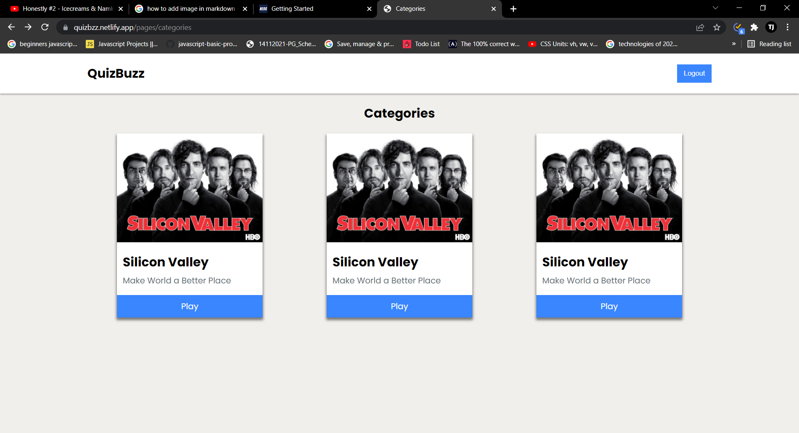
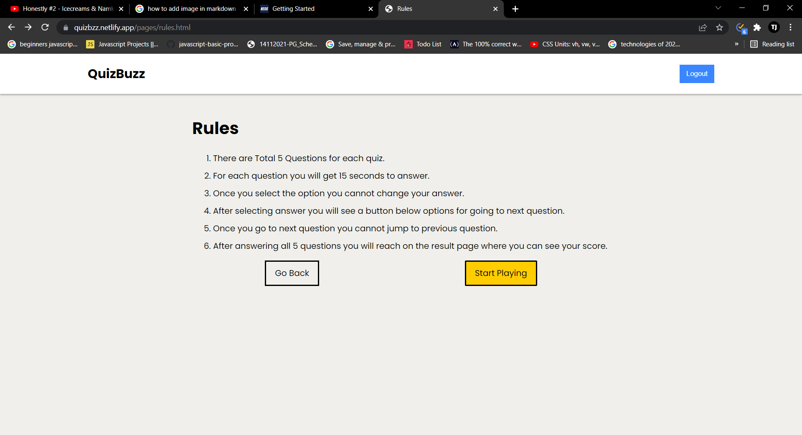
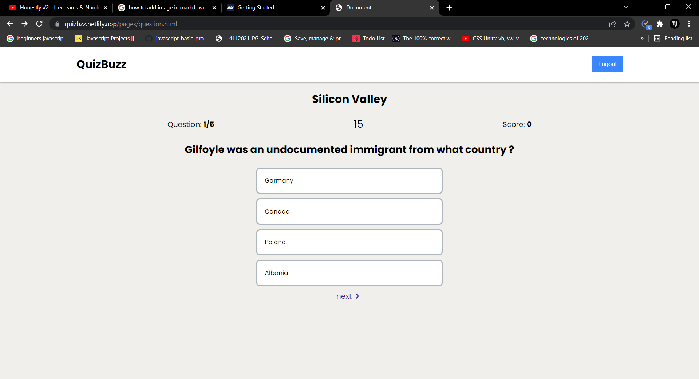
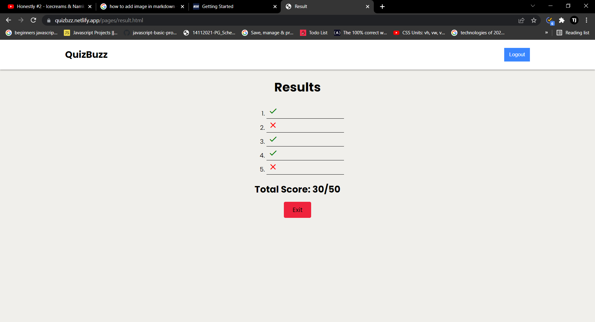

# QUIZBUZZ

QuizBuzz is a Site For Playing Interactive quiz games.

**This Respository Contains the PO screens.**

## Technologies Used

- HTML
- CSS
- PlumeUI

## Pages

- [Home](https://quizbzz.netlify.app/)
- [Categories](https://quizbzz.netlify.app/pages/categories)
- [Rules](https://quizbzz.netlify.app/pages/rules.html)
- [Question](https://quizbzz.netlify.app/pages/question.html)
- [Result](https://quizbzz.netlify.app/pages/result.html)

## Screenshots

### Home

### Categories

### Rules

### Question

### Result

## Author

- Linkedin: [Tajinder](https://www.linkedin.com/in/tajinder-singh-2a0618221/)
